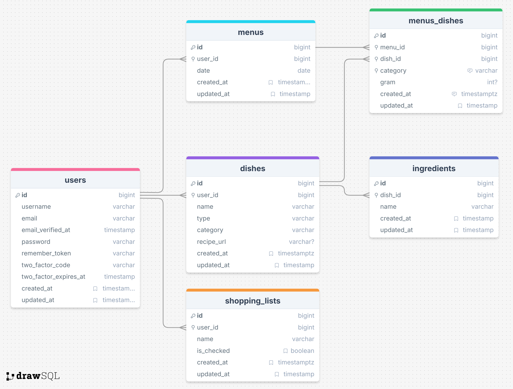

# Fameal - 親子献立カレンダーアプリ

## 🌐 サイトURL
**[https://fameal-app.fly.dev/]**

## 📖 概要
「Fameal」は、離乳食期のお子様を持つご家庭向けの、親子の献立と買い物リストを効率的に管理するアプリケーションです。
大人用と子供用のメニューを同時に管理し、必要な食材を自動で買い物リスト化することで、忙しい子育て世帯の家事負担を軽減します。

## 💡 作成の背景（課題解決）
**【ターゲット】** 
離乳食期（特に初期〜中期期）のお子様を持つ、共働きの保護者

**【背景・課題】** 
私自身の経験から、離乳食期は「大人の食事」と「子供の食事」を別々に考える必要があり、献立管理と買い物リスト管理の負担が非常に大きいと感じていました。

**【解決策】** 
親子のメニューをそれぞれ適した管理内容かつカレンダー形式で可視化し、登録した献立から自動で買い物リストを生成する機能を実装しました。これにより親子の献立及び買い物リスト管理を効率化します。

## 📷 機能一覧
- 献立カレンダー機能
- 料理（離乳食）登録・編集機能
- 買い物リスト機能

## 🛠 使用技術
### フロントエンド
- Blade
- Alpine.js
- Tailwind CSS

### バックエンド
- PHP 8.x
- Laravel v12.x

### インフラ・開発環境
- Docker（Laravel Sail）
- PostgreSQL

### その他ツール
- fullcalendar

## 📂 設計資料

### ER図

 

### 画面設計
